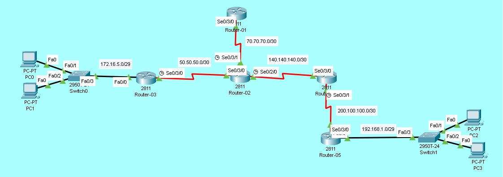

# Basic Static Routing Lab

## Overview
In this lab, we configure static routes on five routers (R1, R2, R3, R4, R5) to enable end-to-end connectivity between PC0/PC1 and PC2/PC3.

## Objectives
- [ ] Configure IP addresses on all interfaces
- [ ] Configure static routes on all routers
- [ ] Verify connectivity using Ping

## Topology


## IP Addressing Table

| Device | Interface | IP Address    | Subnet Mask     | Clock Rate |
|--------|-----------|---------------|-----------------|------------|
| R1    | Se0/3/0   | 70.70.70.1    | 255.255.255.252 | -          |
| R2    | Se0/3/1   | 70.70.70.2      | 255.255.255.252 | 64000      |
| R2     | Se0/3/0     | 50.50.50.2      | 255.255.255.252 | -          |
| R2     | Se0/2/0     | 140.140.140.2      | 255.255.255.252 | 64000      |
| R3     | Se0/3/0     | 50.50.50.1      | 255.255.255.252 | 64000          |
| R3     | Fa0/0     | 172.16.5.1   | 255.255.255.248   | -          |
| R4     | Se0/3/0     | 140.140.140.1   | 255.255.255.252   | -          |
| R4     | Se0/3/1     | 200.100.100.1   | 255.255.255.252   | 64000          |
| R5     | Se0/3/0     | 200.100.100.2   | 255.255.255.252   | -          |
| R5     | Fa0/0     | 192.168.1.1   | 255.255.255.248   | -          |

## Configuration Steps

### Step 1: Basic Interface Configuration
Assign IP addresses to all interfaces and bring them up (`no shutdown`).

### Step 2: Configure Static Routes
**On Router-01:**
```bash
ROUTER-A(config)#ip route 50.50.50.0 255.255.255.252 70.70.70.2
ROUTER-A(config)#ip route 140.140.140.0 255.255.255.252 70.70.70.2
ROUTER-A(config)#ip route 200.100.100.0 255.255.255.252 70.70.70.2
ROUTER-A(config)#ip route 172.16.5.0 255.255.255.248 70.70.70.2
ROUTER-A(config)#ip route 192.168.1.0 255.255.255.248 70.70.70.2
```

**On Router-02:**
```bash
ip route 172.16.5.0 255.255.255.248 50.50.50.1 
ip route 200.100.100.0 255.255.255.252 140.140.140.1 
ip route 192.168.1.0 255.255.255.248 140.140.140.1 
```

**On Router-03:**
```bash
ip route 70.70.70.0 255.255.255.252 50.50.50.2 
ip route 140.140.140.0 255.255.255.252 50.50.50.2 
ip route 200.100.100.0 255.255.255.252 50.50.50.2 
ip route 192.168.1.0 255.255.255.248 50.50.50.2  
```

**On Router-04:**
```bash
ip route 192.168.1.0 255.255.255.248 200.100.100.2 
ip route 70.70.70.0 255.255.255.252 140.140.140.2 
ip route 50.50.50.0 255.255.255.252 140.140.140.2 
ip route 172.16.5.0 255.255.255.248 140.140.140.2
```

**On Router-05:**
```bash
ip route 140.140.140.0 255.255.255.252 200.100.100.1 
ip route 70.70.70.0 255.255.255.252 200.100.100.1 
ip route 50.50.50.0 255.255.255.252 200.100.100.1 
ip route 172.16.5.0 255.255.255.252 200.100.100.1 
```

### Step 3: Verification
**Checking Routing Table**
```bash
ROUTER-01#show ip route

 50.0.0.0/30 is subnetted, 1 subnets
S       50.50.50.0/30 [1/0] via 70.70.70.2
     70.0.0.0/8 is variably subnetted, 2 subnets, 2 masks
C       70.70.70.0/30 is directly connected, Serial0/3/0
L       70.70.70.1/32 is directly connected, Serial0/3/0
     140.140.0.0/30 is subnetted, 1 subnets
S       140.140.140.0/30 [1/0] via 70.70.70.2
     172.16.0.0/29 is subnetted, 1 subnets
S       172.16.5.0/29 [1/0] via 70.70.70.2
     192.168.1.0/29 is subnetted, 1 subnets
S       192.168.1.0/29 [1/0] via 70.70.70.2
     200.100.100.0/30 is subnetted, 1 subnets
S       200.100.100.0/30 [1/0] via 70.70.70.2
```
Look for S (Static) entries in the table.

**Test Connectivity**
```bash
ROUTER-01>ping 192.168.1.2

Type escape sequence to abort.
Sending 5, 100-byte ICMP Echos to 192.168.1.2, timeout is 2 seconds:
!!!!!
Success rate is 100 percent (5/5), round-trip min/avg/max = 9/22/47 ms
```
Success rate should be 100% (5/5).

> **Note:** Full device configurations are available inside the `.pkt` file.

> Key commands are documented above for quick review.

## Troubleshooting Tips
Ping Fails? Check if return route is configured on the destination router.

Interface Down? Ensure no shutdown is applied on serial interfaces.

Wrong Mask? Verify subnet mask matches the network design.

## Files
- [basic-static.pkt](basic-static.pkt) - Open this in Packet Tracer to view full configs
- [topology.png](topology.png) - Network Diagram
