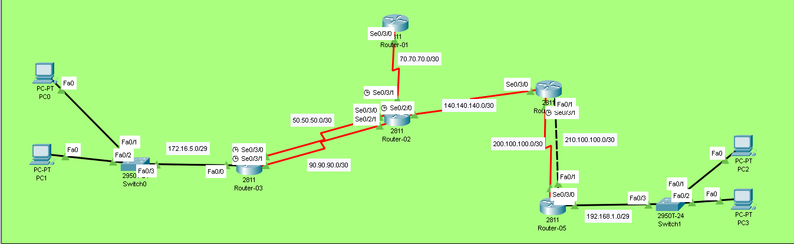

# Floating Static Routing Lab (Backup Routes)

## Overview
In this lab, we configure **Floating Static Routes** which act as backup routes. These routes have a higher **Administrative Distance (AD)** than the primary route and only become active when the primary route fails.

## Objectives
- [ ] Understand Administrative Distance (AD) concept
- [ ] Configure primary static route
- [ ] Configure floating/backup static route
- [ ] Test failover by shutting down primary interface
- [ ] Verify route switching in routing table

## Topology


## IP Addressing Table

| Device | Interface | IP Address    | Subnet Mask     | Clock Rate |
|--------|-----------|---------------|-----------------|------------|
| R1    | Se0/3/0   | 70.70.70.1    | 255.255.255.252 | -          |
| R2    | Se0/3/1   | 70.70.70.2      | 255.255.255.252 | 64000      |
| R2     | Se0/3/0     | 50.50.50.2      | 255.255.255.252 | -          |
| R2     | Se0/2/0     | 140.140.140.2      | 255.255.255.252 | 64000      |
| R2     | Se0/2/1     | 90.90.90.2      | 255.255.255.252 | -      |
| R3     | Se0/3/0     | 50.50.50.1      | 255.255.255.252 | 64000          |
| R3     | Se0/3/1     | 90.90.90.1      | 255.255.255.252 | 64000          |
| R3     | Fa0/0     | 172.16.5.1   | 255.255.255.248   | -          |
| R4     | Se0/3/0     | 140.140.140.1   | 255.255.255.252   | -          |
| R4     | Se0/3/1     | 200.100.100.1   | 255.255.255.252   | 64000          |
| R4     | Fa0/1     | 210.100.100.1   | 255.255.255.252   | -          |
| R5     | Se0/3/0     | 200.100.100.2   | 255.255.255.252   | -          |
| R5     | Fa0/0     | 192.168.1.1   | 255.255.255.248   | -          |
| R5     | Fa0/1     | 210.100.100.2   | 255.255.255.252   | -          |

## Configuration Steps

### Step 1: Basic Interface Configuration
Assign IP addresses to all interfaces and bring them up (`no shutdown`).

### Step 2: Configure Primary Static Route
**Lower AD = Preferred Route (Default AD = 1)**
```bash
ROUTER-03(config)# ip route 70.70.70.0 255.255.255.252 50.50.50.2 50
```

### Step 3: Configure Floating Static Route (Backup)
**Higher AD = Backup Route**
```bash
ROUTER-03(config)# ip route 70.70.70.0 255.255.255.252 90.90.90.2 100
```
> **Note:** The 100 at the end is the Administrative Distance. It must be higher than the primary route's AD.

### Complete Floating Static Route Configuration

**On Router-02:**
```bash
ip route 200.100.100.0 255.255.255.252 140.140.140.1 
ip route 192.168.1.0 255.255.255.248 140.140.140.1 
ip route 172.16.5.0 255.255.255.248 50.50.50.1 50
ip route 172.16.5.0 255.255.255.248 90.90.90.1 100
```

**On Router-03:**
```bash
ip route 70.70.70.0 255.255.255.252 50.50.50.2 50
ip route 70.70.70.0 255.255.255.252 90.90.90.2 100
ip route 140.140.140.0 255.255.255.252 50.50.50.2 50
ip route 140.140.140.0 255.255.255.252 90.90.90.2 100
ip route 200.100.100.0 255.255.255.252 50.50.50.2 50
ip route 200.100.100.0 255.255.255.252 90.90.90.2 100
ip route 192.168.1.0 255.255.255.248 50.50.50.2 50
ip route 192.168.1.0 255.255.255.248 90.90.90.2 100
```

**On Router-04:**
```bash
ip route 70.70.70.0 255.255.255.252 140.140.140.2 
ip route 50.50.50.0 255.255.255.252 140.140.140.2 
ip route 172.16.5.0 255.255.255.248 140.140.140.2 
ip route 192.168.1.0 255.255.255.248 200.100.100.2 50
ip route 192.168.1.0 255.255.255.248 210.100.100.2 100 
```

**On Router-05:**
```bash
ip route 140.140.140.0 255.255.255.252 200.100.100.1 50
ip route 140.140.140.0 255.255.255.252 210.100.100.1 100
ip route 70.70.70.0 255.255.255.252 200.100.100.1 50
ip route 70.70.70.0 255.255.255.252 210.100.100.1 100
ip route 50.50.50.0 255.255.255.252 200.100.100.1 50
ip route 50.50.50.0 255.255.255.252 210.100.100.1 100
ip route 172.16.5.0 255.255.255.252 200.100.100.1 50
ip route 172.16.5.0 255.255.255.252 210.100.100.1 100
```


### Step 3: Verify Routing Table
```bash
ROUTER-03# show ip route
```

### Step 3: Test Failover
```bash
# Shut down primary interface
ROUTER-03(config)# interface Serial0/3/0
ROUTER-03(config-if)# shutdown
```
**Before Failover (Primary Active)**
```bash
ROUTER-03#show ip route

     50.0.0.0/8 is variably subnetted, 2 subnets, 2 masks
C       50.50.50.0/30 is directly connected, Serial0/3/0
L       50.50.50.1/32 is directly connected, Serial0/3/0
     70.0.0.0/30 is subnetted, 1 subnets
S       70.70.70.0/30 [50/0] via 50.50.50.2
     90.0.0.0/8 is variably subnetted, 2 subnets, 2 masks
C       90.90.90.0/30 is directly connected, Serial0/3/1
L       90.90.90.1/32 is directly connected, Serial0/3/1
     140.140.0.0/30 is subnetted, 1 subnets
S       140.140.140.0/30 [50/0] via 50.50.50.2
     172.16.0.0/16 is variably subnetted, 2 subnets, 2 masks
C       172.16.5.0/29 is directly connected, FastEthernet0/0
L       172.16.5.1/32 is directly connected, FastEthernet0/0
     192.168.1.0/29 is subnetted, 1 subnets
S       192.168.1.0/29 [50/0] via 50.50.50.2
     200.100.100.0/30 is subnetted, 1 subnets
S       200.100.100.0/30 [50/0] via 50.50.50.2
```
Look for S (Static) entries in the table.

> **Note:**  Primary route is active (AD = 50)

> Floating route is NOT in routing table (hidden)

**After Failover (Backup Active)**
```bash
ROUTER-03#show ip route

     70.0.0.0/30 is subnetted, 1 subnets
S       70.70.70.0/30 [100/0] via 90.90.90.2
     90.0.0.0/8 is variably subnetted, 2 subnets, 2 masks
C       90.90.90.0/30 is directly connected, Serial0/3/1
L       90.90.90.1/32 is directly connected, Serial0/3/1
     140.140.0.0/30 is subnetted, 1 subnets
S       140.140.140.0/30 [100/0] via 90.90.90.2
     172.16.0.0/16 is variably subnetted, 2 subnets, 2 masks
C       172.16.5.0/29 is directly connected, FastEthernet0/0
L       172.16.5.1/32 is directly connected, FastEthernet0/0
     192.168.1.0/29 is subnetted, 1 subnets
S       192.168.1.0/29 [100/0] via 90.90.90.2
     200.100.100.0/30 is subnetted, 1 subnets
S       200.100.100.0/30 [100/0] via 90.90.90.2

```
Look for S (Static) entries in the table.

> **Note:**  Floating route is now active (AD = 100)

>Primary route is removed (interface down)

**After Recovery (Primary Restored)**
```bash
# Shut down primary interface
ROUTER-03(config)# interface Serial0/3/0
ROUTER-03(config-if)# no shutdown
```

```bash
ROUTER-03#show ip route

     50.0.0.0/8 is variably subnetted, 2 subnets, 2 masks
C       50.50.50.0/30 is directly connected, Serial0/3/0
L       50.50.50.1/32 is directly connected, Serial0/3/0
     70.0.0.0/30 is subnetted, 1 subnets
S       70.70.70.0/30 [50/0] via 50.50.50.2
     90.0.0.0/8 is variably subnetted, 2 subnets, 2 masks
C       90.90.90.0/30 is directly connected, Serial0/3/1
L       90.90.90.1/32 is directly connected, Serial0/3/1
     140.140.0.0/30 is subnetted, 1 subnets
S       140.140.140.0/30 [50/0] via 50.50.50.2
     172.16.0.0/16 is variably subnetted, 2 subnets, 2 masks
C       172.16.5.0/29 is directly connected, FastEthernet0/0
L       172.16.5.1/32 is directly connected, FastEthernet0/0
     192.168.1.0/29 is subnetted, 1 subnets
S       192.168.1.0/29 [50/0] via 50.50.50.2
     200.100.100.0/30 is subnetted, 1 subnets
S       200.100.100.0/30 [50/0] via 50.50.50.2
```
Look for S (Static) entries in the table.

> **Note:**  Primary route takes over again automatically


**Test Connectivity**
```bash
ROUTER-03>ping 192.168.1.2

Type escape sequence to abort.
Sending 5, 100-byte ICMP Echos to 192.168.1.2, timeout is 2 seconds:
!!!!!
Success rate is 100 percent (5/5), round-trip min/avg/max = 9/22/47 ms
```
Success rate should be 100% (5/5).

> **Note:** Full device configurations are available inside the `.pkt` file.

> Key commands are documented above for quick review.

## Troubleshooting Tips
Backup not activating? Check if AD is higher than primary.

Both routes visible? AD values might be the same.

Ping fails during failover? Expect brief packet loss (normal behavior).

Route not floating back? Primary interface might still be down.

##  Key Takeaways
Floating static routes provide redundancy without dynamic routing protocols.
Higher AD = Lower priority (route stays hidden until needed).
Perfect for stub networks or small businesses needing backup.

## Files
- [basic-static.pkt](floating-static.pkt) - Open this in Packet Tracer to view full configs
- [topology.png](topology.png) - Network Diagram
