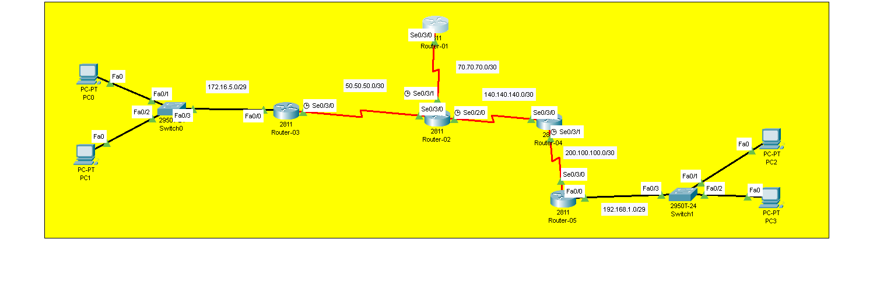

# Recursive Static Routing Lab

## Overview
In this lab, we configure **Recursive Static Routes**. Unlike basic static routing, recursive routes use a **next-hop IP address** that is not directly connected. The router must perform an additional lookup to find how to reach that next-hop.

## Objectives
- [ ] Understand difference between Direct and Recursive static routes
- [ ] Configure recursive static routes on routers
- [ ] Verify routing table shows multiple lookups
- [ ] Test end-to-end connectivity

## Topology


> **Note:** Same topology as Basic Static Lab - focusing on routing method difference.

## IP Addressing Table

| Device | Interface | IP Address    | Subnet Mask     | Clock Rate |
|--------|-----------|---------------|-----------------|------------|
| R1    | Se0/3/0   | 70.70.70.1    | 255.255.255.252 | -          |
| R2    | Se0/3/1   | 70.70.70.2      | 255.255.255.252 | 64000      |
| R2     | Se0/3/0     | 50.50.50.2      | 255.255.255.252 | -          |
| R2     | Se0/2/0     | 140.140.140.2      | 255.255.255.252 | 64000      |
| R3     | Se0/3/0     | 50.50.50.1      | 255.255.255.252 | 64000          |
| R3     | Fa0/0     | 172.16.5.1   | 255.255.255.248   | -          |
| R4     | Se0/3/0     | 140.140.140.1   | 255.255.255.252   | -          |
| R4     | Se0/3/1     | 200.100.100.1   | 255.255.255.252   | 64000          |
| R5     | Se0/3/0     | 200.100.100.2   | 255.255.255.252   | -          |
| R5     | Fa0/0     | 192.168.1.1   | 255.255.255.248   | -          |

## Configuration Steps

### Step 1: Basic Interface Configuration
Assign IP addresses to all interfaces and bring them up (`no shutdown`).

### Step 2: Configure Static Routes

**Key Difference:** Using **next-hop IP** instead of exit interface.

**On Router-1:**
```bash
ip route 50.50.50.0 255.255.255.252 70.70.70.2 
ip route 140.140.140.0 255.255.255.252 70.70.70.2 
ip route 200.100.100.0 255.255.255.252 140.140.140.1 
ip route 172.16.5.0 255.255.255.248 50.50.50.1 
ip route 192.168.1.0 255.255.255.248 200.100.100.2
```

**On Router-2:**
```bash
ip route 172.16.5.0 255.255.255.248 50.50.50.1 
ip route 200.100.100.0 255.255.255.252 140.140.140.1 
ip route 192.168.1.0 255.255.255.248 200.100.100.2
```

**On Router-3:**
```bash
ip route 70.70.70.0 255.255.255.252 50.50.50.2 
ip route 140.140.140.0 255.255.255.252 50.50.50.2 
ip route 200.100.100.0 255.255.255.252 140.140.140.1 
ip route 192.168.1.0 255.255.255.248 200.100.100.2  
```

**On Router-4:**
```bash
ip route 192.168.1.0 255.255.255.248 200.100.100.2 
ip route 70.70.70.0 255.255.255.252 140.140.140.2 
ip route 50.50.50.0 255.255.255.252 140.140.140.2 
ip route 172.16.5.0 255.255.255.248 50.50.50.1
```

**On Router-5:**
```bash
ip route 140.140.140.0 255.255.255.252 200.100.100.1 
ip route 70.70.70.0 255.255.255.252 140.140.140.2 
ip route 50.50.50.0 255.255.255.252 140.140.140.2 
ip route 172.16.5.0 255.255.255.252 50.50.50.1 
```

### Step 3: Verification
**Checking Routing Table**
```bash
ROUTER-01#sh ip route

50.0.0.0/30 is subnetted, 1 subnets
S       50.50.50.0/30 [1/0] via 70.70.70.2
     70.0.0.0/8 is variably subnetted, 2 subnets, 2 masks
C       70.70.70.0/30 is directly connected, Serial0/3/0
L       70.70.70.1/32 is directly connected, Serial0/3/0
     140.140.0.0/30 is subnetted, 1 subnets
S       140.140.140.0/30 [1/0] via 70.70.70.2
     172.16.0.0/29 is subnetted, 1 subnets
S       172.16.5.0/29 [1/0] via 50.50.50.1
     192.168.1.0/29 is subnetted, 1 subnets
S       192.168.1.0/29 [1/0] via 200.100.100.2
     200.100.100.0/30 is subnetted, 1 subnets
S       200.100.100.0/30 [1/0] via 140.140.140.1
```
Look for S (Static) entries in the table.

**Test Connectivity**
```bash
ROUTER-01>ping 192.168.1.3

Type escape sequence to abort.
Sending 5, 100-byte ICMP Echos to 192.168.1.3, timeout is 2 seconds:
!!!!!
Success rate is 100 percent (5/5), round-trip min/avg/max = 3/19/34 ms
```
Success rate should be 100% (5/5) or sometimes 80% (4/5).

## Troubleshooting Tips
Route not in table? Ensure next-hop IP is reachable.

Ping fails? Check return route on destination router.

Recursive lookup issue? Verify intermediate routes exist.

## Files
- [recursive-static.pkt](recursive-static.pkt) - Open this in Packet Tracer to view full configs
- [topology.png](topology.png) - Network Diagram

 > **Note:** Full device configurations are available inside the `.pkt` file.

> Key commands are documented above for quick review. 
