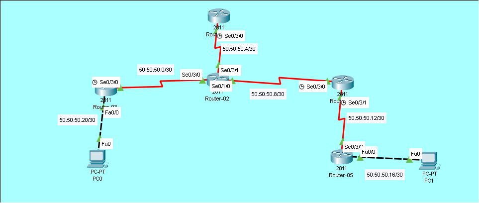

# Summary Static Routing Lab (Route Summarization)

## Overview
In this lab, we configure **Summary Static Routes** which combine multiple network addresses into a single route entry. This reduces the routing table size and improves router efficiency.

## Objectives
- [ ] Understand route summarization concept
- [ ] Calculate summary address and subnet mask
- [ ] Configure summary static route on router
- [ ] Verify multiple networks reachable via single route

## Topology


## IP Addressing Table

| Device | Interface | IP Address    | Subnet Mask     | Clock Rate |
|--------|-----------|---------------|-----------------|------------|
| R1    | Se0/3/0   | 50.50.50.5    | 255.255.255.252 | 64000         |
| R2    | Se0/3/1   | 50.50.50.6      | 255.255.255.252 | -      |
| R2     | Se0/3/0     | 50.50.50.2      | 255.255.255.252 | -          |
| R2     | Se0/1/0     | 50.50.50.10      | 255.255.255.252 | -      |
| R3     | Se0/3/0     | 50.50.50.1      | 255.255.255.252 | 64000          |
| R3     | Fa0/0     | 50.50.50.21   | 255.255.255.252   | -          |
| R4     | Se0/3/0     | 50.50.50.9   | 255.255.255.252   | 64000          |
| R4     | Se0/3/1     | 50.50.50.13   | 255.255.255.252   | 64000          |
| R5     | Se0/3/0     | 50.50.50.14   | 255.255.255.252   | -          |
| R5     | Fa0/0     | 50.50.50.17   | 255.255.255.252   | -          |

## Configuration Steps

### Step 1: Basic Interface Configuration
Assign IP addresses to all interfaces and bring them up (`no shutdown`).

### Step 2: Identify Networks to Summarize

### Step 3: Configure Summary Static Route
**On Router-01:**
```bash
ROUTER-01(config)#ip route 50.0.0.0 255.0.0.0 50.50.50.6 
```

**On Router-02:**
```bash
ROUTER-02(config)#ip route 50.50.50.20 255.255.255.252 50.50.50.1
ROUTER-02(config)#ip route 50.0.0.0 255.0.0.0 50.50.50.9
```

**On Router-03:**
```bash
ROUTER-03(config)#ip route 50.0.0.0 255.0.0.0 50.50.50.2  
```

**On Router-04:**
```bash
ROUTER-04(config)#ip route 50.50.50.16 255.255.255.252 50.50.50.14
ROUTER-04(config)#ip route 50.0.0.0 255.0.0.0 50.50.50.10
```

**On Router-05:**
```bash
ROUTER-05(config)#ip route 50.0.0.0 255.0.0.0 50.50.50.13 
```

### Step 3: Verification
**Checking Routing Table**
```bash
ROUTER-01#show ip route

     50.0.0.0/8 is variably subnetted, 3 subnets, 3 masks
S       50.0.0.0/8 [1/0] via 50.50.50.6
C       50.50.50.4/30 is directly connected, Serial0/3/0
L       50.50.50.5/32 is directly connected, Serial0/3/0
```
Look for S (Static) entries in the table.

**Test Connectivity**
```bash
ROUTER-01#ping 50.50.50.18

Type escape sequence to abort.
Sending 5, 100-byte ICMP Echos to 50.50.50.18, timeout is 2 seconds:
!!!!!
Success rate is 100 percent (5/5), round-trip min/avg/max = 18/23/31 ms
```
Success rate should be 100% (5/5).

> **Note:** Full device configurations are available inside the `.pkt` file.

> Key commands are documented above for quick review.

## Troubleshooting Tips
Some networks unreachable? Summary mask might be too broad.

Overlapping routes? Check for more specific routes in table.

Summary not working? Verify all subnets fall within summary range.

Ping fails? Ensure return routes are also summarized.

## Files
- [summary-static.pkt](summary-static.pkt) - Open this in Packet Tracer to view full configs
- [topology.png](topology.png) - Network Diagram
