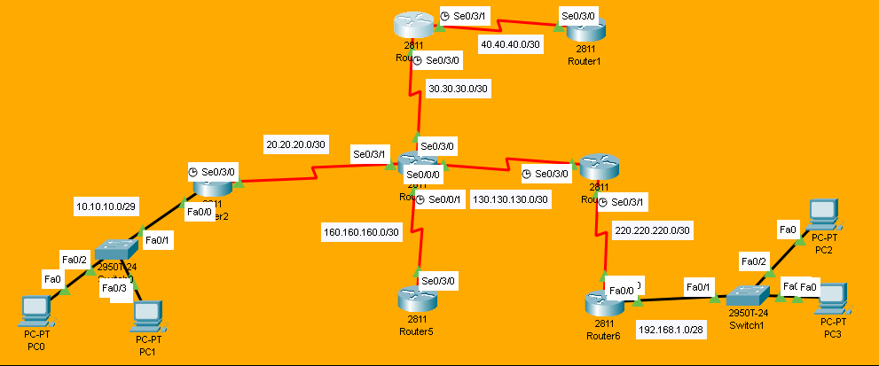

# RIPv1 Basic Configuration Lab

## Overview
In this lab, we configure **RIPv1** - the original version of RIP. RIPv1 is a **classful** routing protocol that doesn't send subnet masks in its updates.

## Objectives
- [ ] Configure IP addresses on all interfaces
- [ ] Enable RIP routing process
- [ ] Advertise directly connected networks
- [ ] Verify neighbor adjacency
- [ ] Check routing table for learned routes
- [ ] Understand classful behavior

## Topology


## IP Addressing Table

| Device | Interface | IP Address    | Subnet Mask     | Clock Rate |
|--------|-----------|---------------|-----------------|------------|
| R0    | Se0/3/0   | 30.30.30.1    | 255.255.255.252 | 64000          |
| R0    | Se0/3/1  | 40.40.40.1    | 255.255.255.252 | 64000          |
| R1    | Se0/3/0   | 40.40.40.2    | 255.255.255.252 | -          |
| R2    | Se0/3/0   | 20.20.20.1      | 255.255.255.252 | 64000      |
| R2     | Fa0/0     | 10.10.10.1      | 255.255.255.248 | -          |
| R3     | Se0/3/0     | 30.30.30.2      | 255.255.255.252 | -          |
| R3     | Se0/3/1     | 20.20.20.2   | 255.255.255.252   | -          |
| R3     | Se0/0/0     | 130.130.130.2   | 255.255.255.252   | -          |
| R3     | Se0/0/1     | 160.160.160.2   | 255.255.255.252   | 64000          |
| R4     | Se0/3/0     | 130.130.130.1   | 255.255.255.252   | 64000          |
| R4     | Se0/3/1     | 220.220.220.1   | 255.255.255.252   | 64000          |
| R5     | Se0/3/0     | 160.160.160.1   | 255.255.255.252   | -          |
| R6     | Se0/3/0     | 220.220.220.2   | 255.255.255.252   | -          |
| R6     | Fa0/0     | 192.168.1.1   | 255.255.255.240   | -          |

## Configuration Steps

### Step 1: Basic Interface Configuration
```bash
R1(config)# interface FastEthernet0/0
R1(config-if)# ip address 192.168.1.1 255.255.255.0
R1(config-if)# no shutdown
```

### Step 2: Enable RIP Routing
**On Router-0:**
```bash
Router-0(config)#router rip
Router-0(config-router)#net 40.0.0.0
Router-0(config-router)#net 30.0.0.0
Router-0(config-router)#exit
```

**On Router-01:**
```bash
Router-1(config)#router rip
Router-1(config-router)#network 40.0.0.0
Router-1(config-router)#exit
```

**On Router-02:**
```bash
Router-2(config)#router rip
Router-2(config-router)#network 10.0.0.0
Router-2(config-router)#net 20.0.0.0
Router-2(config-router)#exit 
```

**On Router-03:**
```bash
Router-3(config)#router rip
Router-3(config-router)#net 20.0.0.0
Router-3(config-router)#net 30.0.0.0
Router-3(config-router)#net 160.160.0.0
Router-3(config-router)#net 130.130.0.0
Router-3(config-router)#exit
```

**On Router-04:**
```bash
Router-4(config)#router rip
Router-4(config-router)#net 130.130.0.0
Router-4(config-router)#net 220.220.220.0
Router-4(config-router)#exit
```

**On Router-05:**
```bash
Router-5(config)#router rip
Router-5(config-router)#net 160.160.0.0
Router-5(config-router)#exit
```

**On Router-06:**
```bash
Router-6(config)#router rip
Router-6(config-router)#net 220.220.220.0
Router-6(config-router)#net 192.168.1.0
Router-6(config-router)#exit
```

### Step 3: Verification
**Checking Routing Table**
```bash
ROUTER-0#show ip route

 R    10.0.0.0/8 [120/2] via 30.30.30.2, 00:00:05, Serial0/3/0
R    20.0.0.0/8 [120/1] via 30.30.30.2, 00:00:05, Serial0/3/0
     30.0.0.0/8 is variably subnetted, 2 subnets, 2 masks
C       30.30.30.0/30 is directly connected, Serial0/3/0
L       30.30.30.1/32 is directly connected, Serial0/3/0
     40.0.0.0/8 is variably subnetted, 2 subnets, 2 masks
C       40.40.40.0/30 is directly connected, Serial0/3/1
L       40.40.40.1/32 is directly connected, Serial0/3/1
R    130.130.0.0/16 [120/1] via 30.30.30.2, 00:00:05, Serial0/3/0
R    160.160.0.0/16 [120/1] via 30.30.30.2, 00:00:05, Serial0/3/0
R    192.168.1.0/24 [120/3] via 30.30.30.2, 00:00:05, Serial0/3/0
R    220.220.220.0/24 [120/2] via 30.30.30.2, 00:00:05, Serial0/3/0
```
Look for R (RIP) entries in the table.

**RIP Protocol Info**
```bash
Router-0#show ip protocols
Routing Protocol is "rip"
Sending updates every 30 seconds, next due in 15 seconds
Invalid after 180 seconds, hold down 180, flushed after 240
Outgoing update filter list for all interfaces is not set
Incoming update filter list for all interfaces is not set
Redistributing: rip
Default version control: send version 1, receive any version
  Interface             Send  Recv  Triggered RIP  Key-chain
  Serial0/3/0           12 1
  Serial0/3/1           12 1
Automatic network summarization is in effect
Maximum path: 4
Routing for Networks:
	30.0.0.0
	40.0.0.0
Passive Interface(s):
Routing Information Sources:
	Gateway         Distance      Last Update
	30.30.30.2           120      00:00:03
Distance: (default is 120)
```
**Test Connectivity**
```bash
Router-0>ping 192.168.1.3

Type escape sequence to abort.
Sending 5, 100-byte ICMP Echos to 192.168.1.3, timeout is 2 seconds:
!!!!!
Success rate is 100 percent (5/5), round-trip min/avg/max = 3/12/31 ms
```
Success rate should be 100% (5/5).

> **Note:** Full device configurations are available inside the `.pkt` file.

> Key commands are documented above for quick review.

## Troubleshooting Tips
No routes learned? Check network statements match connected networks.

Routes showing as 16 hops? Network is unreachable (max is 15).

Version mismatch? Ensure all routers use same RIP version.

Passive interface? Check if interface is set to passive.

## Files
- [RIPv1.pkt](RIPv1.pkt) - Open this in Packet Tracer to view full configs
- [topology.png](topology.png) - Network Diagram
