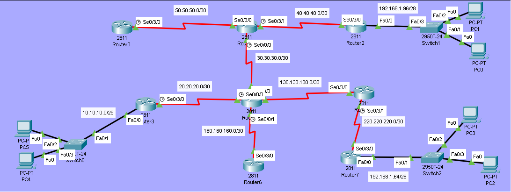

# EIGRP (Enhanced Interior Gateway Routing Protocol) Lab

## Overview
In this lab, we configure **EIGRP** - Cisco's advanced distance-vector routing protocol. EIGRP uses the **DUAL algorithm** for fast convergence and supports VLSM, unequal cost load balancing, and multiple network layer protocols.

## Objectives
- [ ] Configure IP addresses on all interfaces
- [ ] Configure EIGRP with Autonomous System (AS) number
- [ ] Disable automatic summarization
- [ ] Verify VLSM support

## Topology


## IP Addressing Table

| Device | Interface | IP Address    | Subnet Mask     | Clock Rate |
|--------|-----------|---------------|-----------------|------------|
| R0    | Se0/3/0   | 50.50.50.1    | 255.255.255.252 | 64000          |
| R1    | Se0/3/1  | 40.40.40.2    | 255.255.255.252 | 64000          |
| R1    | Se0/3/0   | 50.50.50.2    | 255.255.255.252 | -          |
| R1    | Se0/0/0   | 30.30.30.1    | 255.255.255.252 | 64000          |
| R2    | Se0/3/0   | 40.40.40.1      | 255.255.255.252 | -      |
| R2     | Fa0/0     | 192.168.1.97      | 255.255.255.240 | -          |
| R3     | Se0/3/0     | 20.20.20.1      | 255.255.255.252 | 64000          |
| R3     | Fa0/0     | 10.10.10.1   | 255.255.255.252   | -          |
| R4     | Se0/3/0     | 30.30.30.2      | 255.255.255.252 | -          |
| R4     | Se0/3/1     | 20.20.20.2   | 255.255.255.252   | -          |
| R4     | Se0/0/0     | 130.130.130.2   | 255.255.255.252   | 64000          |
| R4     | Se0/0/1     | 160.160.160.2   | 255.255.255.252   | 64000        
| R5     | Se0/3/0     | 130.130.130.1   | 255.255.255.252   | -          |
| R5     | Se0/3/1     | 220.220.220.1   | 255.255.255.252   | 64000          |
| R6     | Se0/3/0     | 160.160.160.1   | 255.255.255.252   | -          |
| R7     | Se0/3/0     | 220.220.220.2   | 255.255.255.252   | -          |
| R7     | Fa0/0     | 192.168.1.65   | 255.255.255.240   | -          |

## Configuration Steps
### Step 1: Enable EIGRP Routing
**On Router-0:**
```bash
ROUTER-0(config)#router eigrp 999
ROUTER-0(config-router)#network 50.50.50.0 0.0.0.3
ROUTER-0(config-router)#no auto-summary
ROUTER-0(config-router)#exit
```

**On Router-01:**
```bash
ROUTER-1(config)#router eigrp 999
ROUTER-1(config-router)#network 50.50.50.0 0.0.0.3
ROUTER-1(config-router)#network 30.30.30.0 0.0.0.3
ROUTER-1(config-router)#network 40.40.40.0 0.0.0.3
ROUTER-1(config-router)#no auto-summary
```

**On Router-02:**
```bash
ROUTER-2(config)#router eigrp 999
ROUTER-2(config-router)#network 40.40.40.0 0.0.0.3
ROUTER-2(config-router)#network 192.168.1.96 0.0.0.15
ROUTER-2(config-router)#no auto-summary
```

**On Router-03:**
```bash
ROUTER-3(config)#router eigrp 999
ROUTER-3(config-router)#network 20.20.20.0 0.0.0.3
ROUTER-3(config-router)#network 10.10.10.0 0.0.0.7
ROUTER-3(config-router)#no auto-summary
```

**On Router-04:**
```bash
Router-4(config)#router eigrp 999
Router-4(config-router)#network 20.20.20.0 0.0.0.3
Router-4(config-router)#network 160.160.160.0 0.0.0.3
Router-4(config-router)#network 130.130.130.0 0.0.0.3
Router-4(config-router)#network 30.30.30.0 0.0.0.3
Router-4(config-router)#no auto-summary
```

**On Router-05:**
```bash
ROUTER-5(config)#router eigrp 999
ROUTER-5(config-router)#network 220.220.220.0 0.0.0.3
ROUTER-5(config-router)#network 130.130.130.0 0.0.0.3
ROUTER-5(config-router)#no auto-summary
```

**On Router-06:**
```bash
ROUTER-6(config)#router eigrp 999
ROUTER-6(config-router)#network 160.160.160.0 0.0.0.3
ROUTER-6(config-router)#no auto-summary
```

**On Router-07:**
```bash
Router-7(config)#router eigrp 999
Router-7(config-router)#network 220.220.220.0 0.0.0.3
Router-7(config-router)#network 192.168.1.64 0.0.0.15
Router-7(config-router)#no auto-summary
```

>**Note:**
>AS Number (999) must match on all routers
>Wildcard mask is used (inverse of subnet mask) 

### Step 2: Verify EIGRP Configuration
**Neighbor Table**
```bash
ROUTER-4#show ip eigrp neighbors
IP-EIGRP neighbors for process 999
H   Address         Interface      Hold Uptime    SRTT   RTO   Q   Seq
                                   (sec)          (ms)        Cnt  Num
0   20.20.20.1      Se0/3/1        13   00:24:12  40     1000  0   17
1   160.160.160.1   Se0/0/1        11   00:23:58  40     1000  0   19
2   130.130.130.1   Se0/0/0        12   00:23:48  40     1000  0   20
3   30.30.30.1      Se0/3/0        12   00:23:35  40     1000  0   21
```

**Routing Table**
```bash
ROUTER-4#show ip route
     10.0.0.0/29 is subnetted, 1 subnets
D       10.10.10.0/29 [90/2172416] via 20.20.20.1, 00:24:56, Serial0/3/1
     20.0.0.0/8 is variably subnetted, 2 subnets, 2 masks
C       20.20.20.0/30 is directly connected, Serial0/3/1
L       20.20.20.2/32 is directly connected, Serial0/3/1
     30.0.0.0/8 is variably subnetted, 2 subnets, 2 masks
C       30.30.30.0/30 is directly connected, Serial0/3/0
L       30.30.30.2/32 is directly connected, Serial0/3/0
     40.0.0.0/30 is subnetted, 1 subnets
D       40.40.40.0/30 [90/2681856] via 30.30.30.1, 00:24:20, Serial0/3/0
     50.0.0.0/30 is subnetted, 1 subnets
D       50.50.50.0/30 [90/2681856] via 30.30.30.1, 00:24:20, Serial0/3/0
     130.130.0.0/16 is variably subnetted, 2 subnets, 2 masks
C       130.130.130.0/30 is directly connected, Serial0/0/0
L       130.130.130.2/32 is directly connected, Serial0/0/0
     160.160.0.0/16 is variably subnetted, 2 subnets, 2 masks
C       160.160.160.0/30 is directly connected, Serial0/0/1
L       160.160.160.2/32 is directly connected, Serial0/0/1
     192.168.1.0/28 is subnetted, 2 subnets
D       192.168.1.64/28 [90/2684416] via 130.130.130.1, 00:24:32, Serial0/0/0
D       192.168.1.96/28 [90/2684416] via 30.30.30.1, 00:24:20, Serial0/3/0
     220.220.220.0/30 is subnetted, 1 subnets
D       220.220.220.0/30 [90/2681856] via 130.130.130.1, 00:24:32, Serial0/0/0
```
>**Note:**
>D = EIGRP route (Administrative Distance = 90)

**Topology Table**
```bash
ROUTER-4#show ip eigrp topology
IP-EIGRP Topology Table for AS 999/ID(160.160.160.2)

Codes: P - Passive, A - Active, U - Update, Q - Query, R - Reply,
       r - Reply status

P 10.10.10.0/29, 1 successors, FD is 2172416
         via 20.20.20.1 (2172416/28160), Serial0/3/1
P 20.20.20.0/30, 1 successors, FD is 2169856
         via Connected, Serial0/3/1
P 30.30.30.0/30, 1 successors, FD is 2169856
         via Connected, Serial0/3/0
P 40.40.40.0/30, 1 successors, FD is 2681856
         via 30.30.30.1 (2681856/2169856), Serial0/3/0
P 50.50.50.0/30, 1 successors, FD is 2681856
         via 30.30.30.1 (2681856/2169856), Serial0/3/0
P 130.130.130.0/30, 1 successors, FD is 2169856
         via Connected, Serial0/0/0
P 160.160.160.0/30, 1 successors, FD is 2169856
         via Connected, Serial0/0/1
P 192.168.1.64/28, 1 successors, FD is 2684416
         via 130.130.130.1 (2684416/2172416), Serial0/0/0
P 192.168.1.96/28, 1 successors, FD is 2684416
         via 30.30.30.1 (2684416/2172416), Serial0/3/0
P 220.220.220.0/30, 1 successors, FD is 2681856
         via 130.130.130.1 (2681856/2169856), Serial0/0/0
```

## Troubleshooting Tips
No neighbors? Verify AS number matches on all routers.

Routes not appearing? Check network statements use correct wildcard masks.

Adjacency stuck? Ensure no auto-summary is configured on all routers.

## Files
- [EIGRP.pkt](EIGRP.pkt) - Open this in Packet Tracer to view full configs
- [topology.png](topology.png) - Network Diagram

> **Note:** Full device configurations are available inside the `.pkt` file.

> Key commands are documented above for quick review.