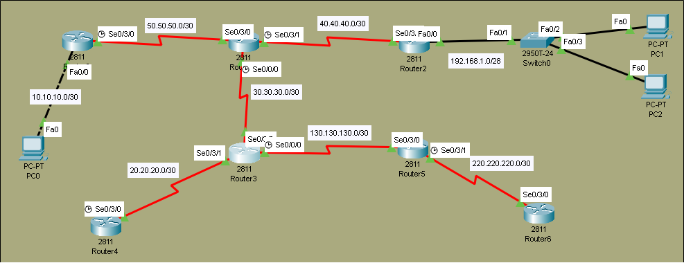

# OSPF (Open Shortest Path First) Lab

## Overview
In this lab, we configure **OSPF** - a link-state routing protocol used in enterprise networks. OSPF uses the **SPF (Dijkstra) algorithm** to calculate the best path and supports features like areas, authentication, and fast convergence.

## Objectives
- [ ] Configure OSPF with Process ID and Area
- [ ] Verify neighbor adjacency (FULL state)
- [ ] Verify routes in routing table

## Topology


## IP Addressing Table

| Device | Interface | IP Address    | Subnet Mask     | Clock Rate |
|--------|-----------|---------------|-----------------|------------|
| R0    | Se0/3/0   | 50.50.50.1    | 255.255.255.252 | 64000          |
| R1    | Se0/3/1  | 40.40.40.2    | 255.255.255.252 | 64000          |
| R1    | Se0/3/0   | 50.50.50.2    | 255.255.255.252 | -          |
| R1    | Se0/0/0   | 30.30.30.2    | 255.255.255.252 | 64000          |
| R2    | Se0/3/0   | 40.40.40.1      | 255.255.255.252 | -      |
| R2     | Fa0/0     | 192.168.1.1      | 255.255.255.240 | -          |
| R3     | Se0/3/0     | 30.30.30.1      | 255.255.255.252 | -          |
| R3     | Se0/3/1     | 20.20.20.1   | 255.255.255.252   | -          |
| R3     | Se0/0/0     | 130.130.130.1   | 255.255.255.252   | 64000          |
| R4     | Se0/3/0     | 20.20.20.2      | 255.255.255.252 | 64000          |      
| R5     | Se0/3/0     | 130.130.130.2   | 255.255.255.252   | -          |
| R5     | Se0/3/1     | 220.220.220.2   | 255.255.255.252   | 64000          |
| R6     | Se0/3/0     | 220.220.220.1   | 255.255.255.252   | -          |

## Configuration Steps

### Step 1: Enable OSPF Routing
**On Router-0:**
```bash
ROUTER-0(config)#router ospf 99
ROUTER-0(config-router)#network 50.50.50.0 0.0.0.3 area 0
ROUTER-0(config-router)#network 10.10.10.0 0.0.0.3 area 0
```

**On Router-01:**
```bash
ROUTER-1(config)#router ospf 99
ROUTER-1(config-router)#network 50.50.50.0 0.0.0.3 area 0
ROUTER-1(config-router)#network 30.30.30.0 0.0.0.3 area 0
ROUTER-1(config-router)#network 40.40.40.0 0.0.0.3 area 0
```

**On Router-02:**
```bash
ROUTER-2(config)#router ospf 99
ROUTER-2(config-router)#network 192.168.1.0 0.0.0.15 area 0
ROUTER-2(config-router)#network 40.40.40.0 0.0.0.3 area 0
```

**On Router-03:**
```bash
ROUTER-3(config)#router ospf 99
ROUTER-3(config-router)#network 30.30.30.0 0.0.0.3 area 0
ROUTER-3(config-router)#network 20.20.20.0 0.0.0.3 area 0
ROUTER-3(config-router)#network 130.130.130.0 0.0.0.3 area 0
```

**On Router-04:**
```bash
ROUTER-4(config)#router ospf 99
ROUTER-4(config-router)#network 20.20.20.0 0.0.0.3 area 0
```

**On Router-05:**
```bash
ROUTER-5(config)#router ospf 99
ROUTER-5(config-router)#network 130.130.130.0 0.0.0.3 area 0
ROUTER-5(config-router)#network 220.220.220.0 0.0.0.3 area 0
```

**On Router-06:**
```bash
ROUTER-6(config)#router ospf 99
ROUTER-6(config-router)#network 220.220.220.0 0.0.0.3 area 0
```

> **Note:** Process ID (99) is locally significant

> Area 0 is the backbone area

>Wildcard mask is used (inverse of subnet mask)

### Step 2: Verify OSPF Configuration
```bash
show ip ospf neighbor
show ip route 
show ip protocols
```

**Neighbor Table:**
```bash
ROUTER-3#show ip ospf neighbor


Neighbor ID     Pri   State           Dead Time   Address         Interface
220.220.220.2     0   FULL/  -        00:00:35    130.130.130.2   Serial0/0/0
50.50.50.2        0   FULL/  -        00:00:37    30.30.30.2      Serial0/3/0
20.20.20.2        0   FULL/  -        00:00:33    20.20.20.2      Serial0/3/1
```
> **Note:** Full state means adjacency is complete.

**Routing Table:**
```bash
ROUTER-3#show ip route

  10.0.0.0/30 is subnetted, 1 subnets
O       10.10.10.0/30 [110/129] via 30.30.30.2, 00:16:10, Serial0/3/0
     20.0.0.0/8 is variably subnetted, 2 subnets, 2 masks
C       20.20.20.0/30 is directly connected, Serial0/3/1
L       20.20.20.1/32 is directly connected, Serial0/3/1
     30.0.0.0/8 is variably subnetted, 2 subnets, 2 masks
C       30.30.30.0/30 is directly connected, Serial0/3/0
L       30.30.30.1/32 is directly connected, Serial0/3/0
     40.0.0.0/30 is subnetted, 1 subnets
O       40.40.40.0/30 [110/128] via 30.30.30.2, 00:16:10, Serial0/3/0
     50.0.0.0/30 is subnetted, 1 subnets
O       50.50.50.0/30 [110/128] via 30.30.30.2, 00:16:10, Serial0/3/0
     130.130.0.0/16 is variably subnetted, 2 subnets, 2 masks
C       130.130.130.0/30 is directly connected, Serial0/0/0
L       130.130.130.1/32 is directly connected, Serial0/0/0
     192.168.1.0/28 is subnetted, 1 subnets
O       192.168.1.0/28 [110/129] via 30.30.30.2, 00:16:10, Serial0/3/0
     220.220.220.0/30 is subnetted, 1 subnets
O       220.220.220.0/30 [110/128] via 130.130.130.2, 00:15:30, Serial0/0/0
```
> **Note:** O = OSPF route(Administrative Distance = 110).

## Troubleshooting Tips
No neighbors? Verify area number matches on connected interfaces.

Routes not appearing? Ensure network statements use correct wildcard masks.

Interface not participating? Check if interface is set to passive-interface.

## Files
- [OSPF.pkt](OSPF.pkt) - Open this in Packet Tracer to view full configs
- [topology.png](topology.png) - Network Diagram

> **Note:** Full device configurations are available inside the `.pkt` file.

> Key commands are documented above for quick review.