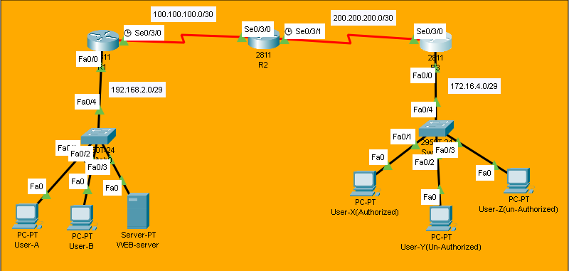

# Extended-ACL Lab

## Overview
In this lab, we configure **Extended ACL** which filters traffic based on **source IP, destination IP, protocol (TCP/UDP/ICMP), and port numbers**. Extended ACLs provide granular control and are typically placed close to the source network.

## Objectives
- [ ] Understand Extended ACL numbering (100-199)
- [ ] Create ACL to filter by protocol and port
- [ ] Apply ACL to interface (in/out direction)
- [ ] Verify ACL with show commands
- [ ] Test traffic filtering (HTTP, ICMP, etc.)

## Topology


## IP Addressing Table

| Device | Interface | IP Address    | Subnet Mask     | Clock Rate |
|--------|-----------|---------------|-----------------|------------|
| R1    | Se0/3/0   | 100.100.100.1    | 255.255.255.252 | 64000          |
| R1    | Fa0/0  | 192.168.2.1    | 255.255.255.248 | -            |
| R2    | Se0/3/0   | 100.100.100.2    | 255.255.255.252 | -          |
| R2    | Se0/3/1   | 200.200.200.2    | 255.255.255.252 | 64000          |
| R3    | Se0/3/0   | 200.200.200.1      | 255.255.255.252 | -      |
| R3     | Fa0/0     | 172.16.4.1      | 255.255.255.248 | -          |

## Configuration Steps

### Step 1: Create Extended ACL
```bash
R3(config)#access-list 199 permit tcp host 172.16.4.2 host 192.168.2.4 eq www
R3(config)#access-list 199 deny tcp any host 192.168.2.4 eq www
R3(config)#access-list 199 permit ip any any
```
> **Note:** Order matters! ACL is processed top-to-bottom..

### Step 2: Apply ACL to Interface
```bash
R3(config)#int se0/3/0
R3(config-if)#ip access-group 199 out
R3(config-if)#exit
```

### Step 3: Verify ACL Configuration
```bash
R3#show access-lists
Extended IP access list 199
    10 permit tcp host 172.16.4.2 host 192.168.2.4 eq www (6 match(es))
    20 deny tcp any host 192.168.2.4 eq www (29 match(es))
    30 permit ip any any (2 match(es))
```


## Troubleshooting Tips
ACL not working? Verify ACL is applied to correct interface and direction.

All traffic blocked? Check if permit ip any any is added at the end.

Wrong traffic filtered? Verify ACL order - first match wins!

Port not blocking? Ensure correct protocol (tcp/udp) is specified.

Hit counters not increasing? Traffic might not be matching ACL criteria.

## Files
- [extended-acl.pkt](extended-acl.pkt) - Open this in Packet Tracer to view full configs
- [topology.png](topology.png) - Network Diagram

> **Note:** Full device configurations are available inside the `.pkt` file.

> Key commands are documented above for quick review.