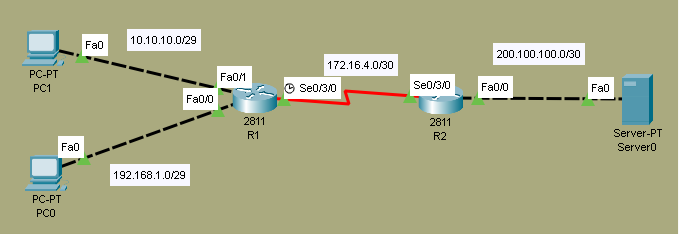

# Standard ACL Lab

## Overview
In this lab, we configure **Standard ACL** which filters traffic based on **source IP address only**. Standard ACLs are simple to configure and are typically placed close to the destination network.

## Objectives
- [ ] Understand Standard ACL numbering (1-99)
- [ ] Create ACL to permit/deny specific networks
- [ ] Apply ACL to interface (in/out direction)
- [ ] Verify ACL with show commands
- [ ] Test traffic filtering with ping

## Topology


## IP Addressing Table

| Device | Interface | IP Address    | Subnet Mask     | Clock Rate |
|--------|-----------|---------------|-----------------|------------|
| R1    | Se0/3/0   | 172.16.4.1    | 255.255.255.252 | 64000          |
| R1    | Fa0/0  | 192.168.1.1    | 255.255.255.248 | -            |
| R1    | Fa0/1   | 10.10.10.1    | 255.255.255.248 | -          |
| R2    | Se0/3/0   | 172.16.4.2      | 255.255.255.252 | -      |
| R2     | Fa0/0     | 200.100.100.1      | 255.255.255.252 | -          |

## Configuration Steps

### Step 1: Create Standard ACL
**Scenario:** 
Block 192.168.1.0/29 from accessing 200.100.100.0/30
Allow 10.10.10.0/29 to access 200.100.100.0/30

```bash
R2(config)#access-list 49 permit 10.10.10.0 0.0.0.7
R2(config)#access-list 49 deny 192.168.1.0 0.0.0.7
```

### Step 2: Apply ACL to Interface
```bash
R2(config)#int fa0/0
R2(config-if)#ip access-group 49 out
```

### Step 3: Verify ACL Configuration
```bash
R2#show access-lists
Standard IP access list 49
    10 permit 10.10.10.0 0.0.0.7 (2 match(es))
    20 deny 192.168.1.0 0.0.0.7 (17 match(es))
```

```bash
R2#show ip interface Fa0/0
FastEthernet0/0 is up, line protocol is up (connected)
  Internet address is 200.100.100.1/30

  Outgoing access list is 49
  Inbound  access list is not set
```

## Troubleshooting Tips
ACL not working? Verify ACL is applied to correct interface and direction.

Wrong hosts blocked? Verify wildcard mask calculation is correct.

ACL not showing matches? Use show access-lists to check hit counters.

Interface wrong direction? Remember: in = entering router, out = leaving router.

## Files
- [standard-acl.pkt](standard-acl.pkt) - Open this in Packet Tracer to view full configs
- [topology.png](topology.png) - Network Diagram

> **Note:** Full device configurations are available inside the `.pkt` file.

> Key commands are documented above for quick review.